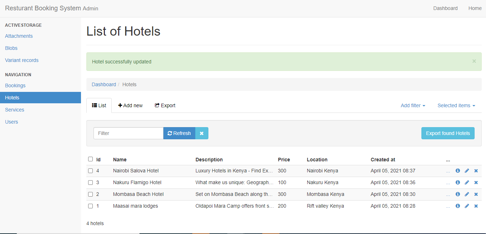

# HOTEL BOOKING APPLICATION (API)
> This is the API application for my hotel booking system. The API is responsible for creating and making booking for hotels all over the world.





## Built With

- Ruby 2.7.2
- Ruby on rails 6.0.0
- VS Code
- Postgresql database

## How to Install

- Install Ruby in your system. To install Ruby, you can read the [Documentation](https://www.ruby-lang.org/en/documentation/installation/)
- Install rails to do that run this command in your console
    ``` 
    gem install rails

    ``` 
- Then For Windows users, open Command Prompt and run:
    ```console
    C:\>cd Hotel_Booking_system folder
    C:\cd Hotel_Booking_system folder> run rails server
    ```
- Open another terminal or Command line and run:  

  ```
    $ rails db:create
    $ rails db:migrate
    
    ``` 
- For Linux and Mac users, open a Terminal and run:
    ```console
    
    $ cd Hotel_Booking_system  folder
    $ rails db:create
    $ rails db:migrate

    ``` 
- Navigate to your browser and run
 
   ```
   localhost:3000

   ```
- To see the live site check here

   [Live Demo Link](https://robert-booking-api.herokuapp.com/)


- To see the admin page

   [Live Demo Link](https://robert-booking-api.herokuapp.com//admin)


## Authors  

👤 **Peter Robert**

- Github: [@peterrobert](https://github.com/peterrobert)
- Twitter: [@ptahwambui93](https://twitter.com/Ptahwambui93)
- Linkedin: [Peter Robert Ndungu](https://www.linkedin.com/in/peter-rob-ndungu/)


## 🤝 Contributing

Contributions, issues and feature requests are welcome!. Feel free to check the [issues page](issues/).

## Show your support
